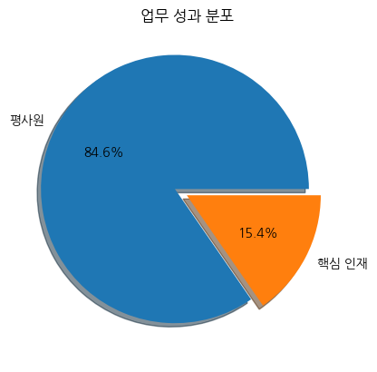
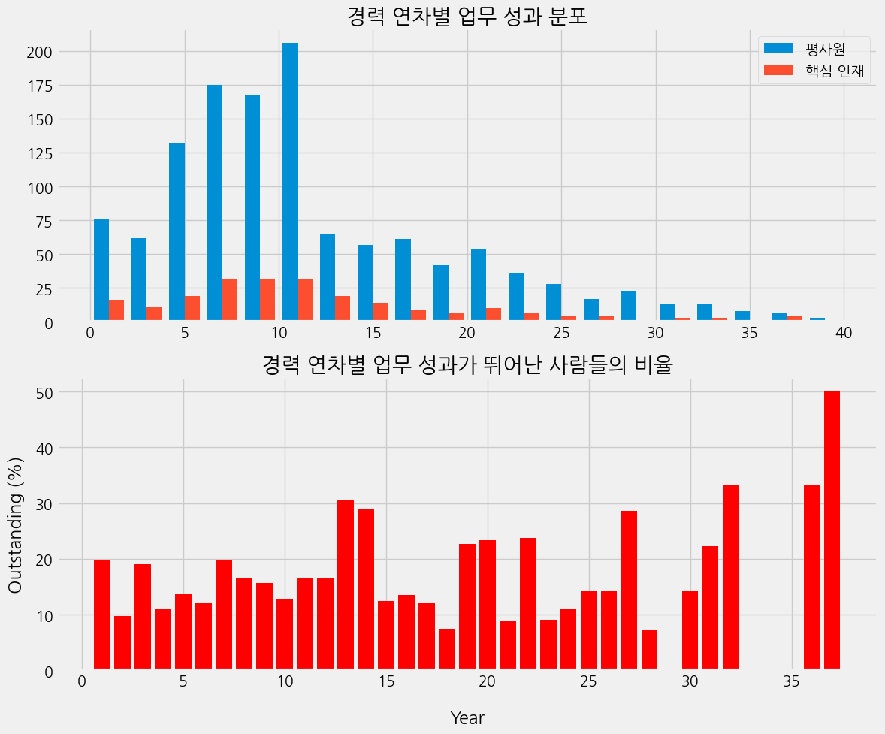
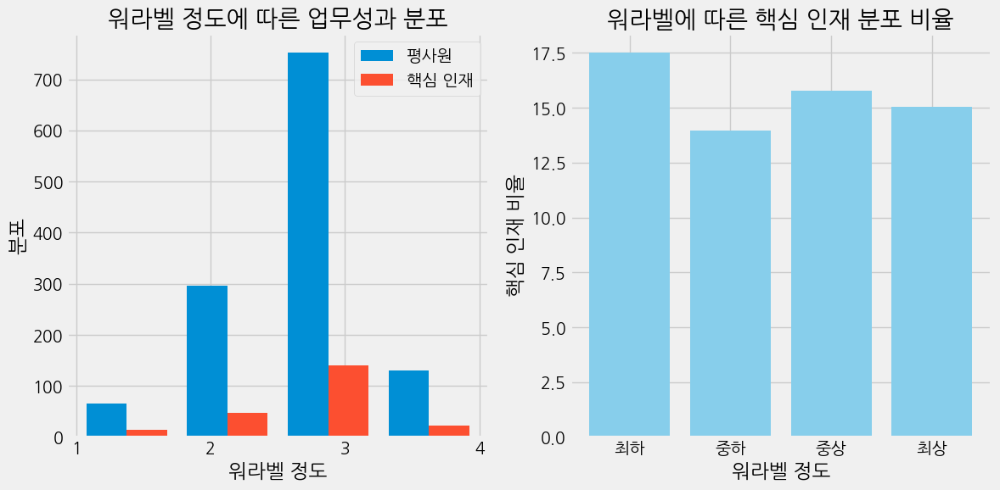
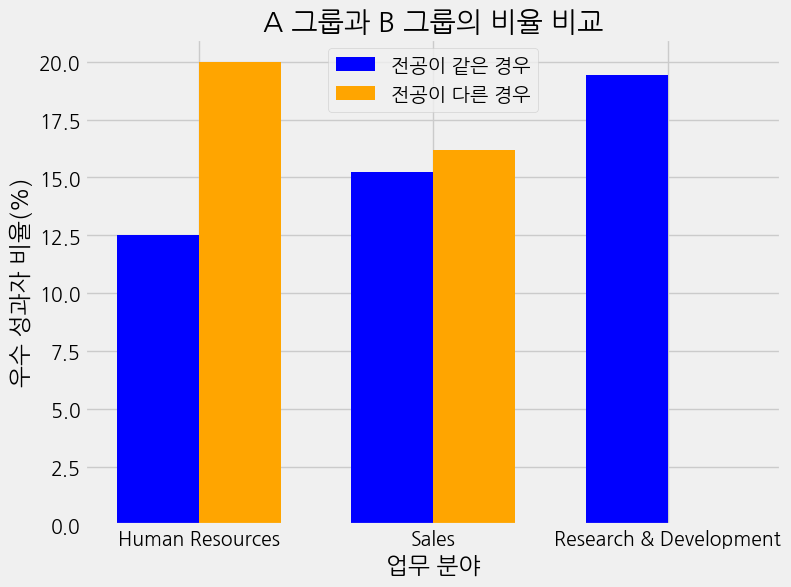
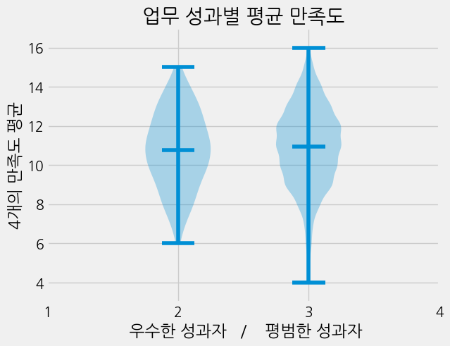
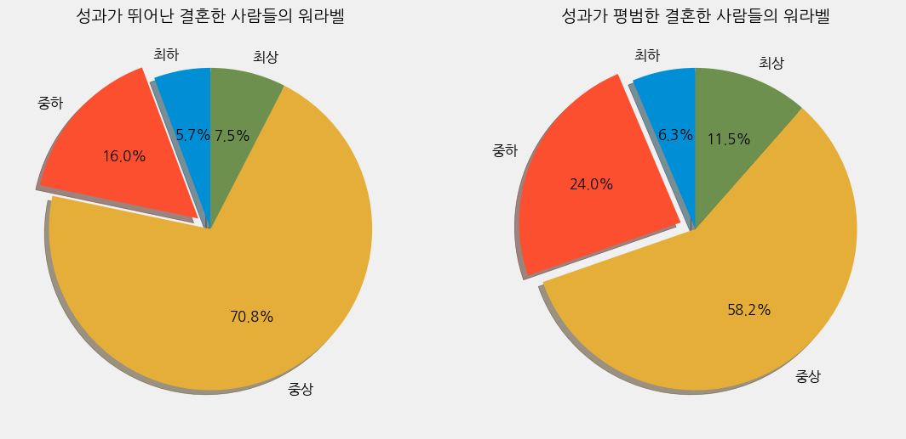

업무 성과가 뛰어난 직원들 분석
==============

요약
--------------------------------------
1. 기본 정보
- 개인 프로젝트(기여도 100%)
- 진행 기간 : 2024.02.15 ~ 2024.02.19
- 작업 환경 : Colab
***
1. 프로젝트 진행 배경
- HR 데이터셋을 가지고 분석 역량을 쌓고자 진행하였습니다.
- 논리적인 결론을 도출해내고자 진행하였습니다.
***


3. 데이터셋

470명의 35가지 요인이 존재하는 데이터셋​

명목형 데이터 : 직원 ID(PK), 업무 분야, 전공, 성별, 업무 종류, 결혼 여부, 규정 외 노동시간​

순서형 데이터 :  출장 빈도, 학력, 업무환경 만족도, 업무 참여도, 업무 수준. 업무 만족도, 업무 성과, 대인관게 만족도, 스톡옵션 정도, 워라벨 정도​

수치형 데이터 : 나이, 집과의 거리, 시간 대비 급여 수준, 일 대비 급여 수준, 월 대비 급여 수준, 월 소득, 급여의 증가분 백분율, 일한 회사의 수, 경력 기간, 교육 시간, 근속 연수, 현재 역할의 연수, 마지막 승진, 현재 관리자와 함께 보낸 시간​

이진 데이터 : 퇴직 여부


***
### 1. 문제 정의
   
- 업무 성과가 뛰어난 사람들을 해당 기업의 핵심 인재라고 부릅니다.   
- 핵심 인재 분포가 많을수록 기업의 생산력이 증가합니다.
- 그로 인해 기업의 생산력을 증가시키기 위해 핵심 인재를 양성할 필요가 있다고 판단됩니다.
- 핵심 인재 양성을 위해 핵심 인재의 특징을 분석하였습니다.

***
### 2. 문제 인식

- 기업의 핵심 인재 비율이 전체 직원들 중 15.4%입니다.
- 핵심 인재를 더 양성하면 기업의 생산력은 더욱 증가할 것으로 보입니다.
-------

### 3. EDA
###### 1. 경력 연차에 따른 핵심 인재 EDA

  - 5년에서 10년 사이의 경력을 가진 직원들의 분포가 제일 많다
  - 경력이 쌓일수록 핵심 인재 비율이 높다고 보기에는 어렵다고 할 수 있다.

----

###### 2. 워라벨에 따른 핵심 인재 EDA


  - 핵심 인재들 중 워라벨이 최하라고 느끼는 직원들이 제일 많은 것을 보아 워라벨과 핵심 인재는 서로 영향을 끼치지 않는 것이 보입니다.
------ 

### 4. 가설 수립
###### 1. ```현재 업무 분야가 전공과 달라도 우수 성과자가 될 수 있을까?```
- 이유
  - 저의 전공이 제가 가려는 분야와 다르기 때문에 과연 가려는 업무와 전공은 연관이 있을까 싶어 분석을 시도해보려 했습니니다.
- 분석 설계
  - 전처리 : 전공과 업무 분야 이름이 같은 데이터는 'Human Resources'분야 였고 'Sales'분야는 전공이 'Sales'인 사람들이 없어 'Marketing'이 전공인 사람들을 같은 전공이라고 분류하였습니다. 'Research & Development'의 경우 이 데이터의 회사가 의료 계열 회사로 보여 'Medical', 'Technical Degree', 'Life Sciences' 이 셋의 전공이 같은 전공이라고 분류하여 진행하였습니다.
  - 비교 지표 : 전공과 업무 분야가 같은 사람 vs 전공과 업무 분야가 다른 사람
  - 관심 지표 : 핵심 인재 분포 비율

-------
###### 2. ```현재 일하는 것에 대한 만족도가 높으면 성과가 뛰어날까?```
- 근거
   - 'EnvironmentSatisfaction', 'WorkLifeBalance', 'RelationshipSatisfaction', 'JobSatisfaction' 이렇게 4개의 데이터가 1~4까지의 수치로 되어진 만족도에 관련된 데이터였습니다. 
   - 직원들의 종합적인 만족도가 높으면 업무 성과가 뛰어날까에 대한 접근으로 시작되었습니다.
- 분석 설계
  - 비교 지표 : 핵심 인재 vs 평사원
  - 관심 지표 : 종합 만족도 = 'EnvironmentSatisfaction' + 'WorkLifeBalance' + 'RelationshipSatisfaction' + 'JobSatisfaction'
------
###### 3. ```결혼한 사람들의 워라벨을 보장해주면 업무 성과가 높을까?```
- 근거
  - 결혼한 사람들의 워라벨은 중요하다고 생각하였습니다. 결혼하여 자녀가 있는 경우에는 더 중요하다고 판단되었지만 해당 데이터에는 자녀의 존재 여부는 존재하지 않았습니다. 
- 분석 설계
  - 비교 지표 : 결혼한 핵심 인재 vs 결혼한 평사원
  - 관심 지표 : 워라벨 정도
---------
### 4. 분석
###### 1. ```현재 업무 분야가 전공과 달라도 우수 성과자가 될 수 있을까?```

- Human Resources 분야와 sales 분야는 전공이 다른 사람들이 더 뛰어난 성과를 보이는 비율이 더 많습니다. 
- Research & Development 분야는 전공과 업무 분야가 다른 사람들은 뛰어난 성과를 보이지 못합니다. 해당 분야의 모든 핵심 인재들은 전공과 업무 분야가 같습니다.
-------
###### 2. ```현재 일하는 것에 대한 만족도가 높으면 성과가 뛰어날까?```

- 핵심 인재와 평사원들의 평균 종합 만족도는 서로 같습니다.
- 하지만 핵심인재의 평균 만족도의 분포와 평사원의 평균 만족도의 분포는 다른 것을 확인할 수 있습니다. 
  - 평사원의 경우 만족도가 모두 최하인 인원들이 존재하는 것을 알 수 있습니다.
------
###### 3. ```결혼한 사람들의 워라벨을 보장해주면 업무 성과가 높을까?```

- 파이차트를 비교해보면 결혼한 사람들중 성과가 뛰어난 사람들의 워라벨 정도가 중하인 비율이 성과가 평범한 사람들의 워라벨 정도가 중하인 비율보다 8% 낮습니다. 
- 핵심 인재의 워라벨이 중상인 비율은 평사원의 워라벨이 중상인 비율보다 12% 높습니다.
----------

### 6. 결론
##### 1. ```업무 분야와 전공```
- 'Human Resources'와 'Sales'분야의 인력을 충원할때는 해당 분야와 상관없는 전공인 사람들을 충원해도 충분히 우수 성과자가 될 수 있습니다. 따라서 인력 충원시 전공보다는 회사의 비전과 분위기에 맞는 인재를 뽑는 것이 우수 성과자를 증가시킬 수 있는 포인트입니다.
- 'Research & Development'의 경우 업무와 전공이 다른 직원들은 우수 성과를 내는 직원은 0% 입니다. 반대로 전공자의 20%는 우수 성과자 입니다. 우수 성과자들을 늘리기 위해서는 해당 분야 인력을 모집할 경우 반드시 전공자들을 모집하는 것이 유리해보입니다.
##### 2. ```종합 만족도```
- 성과가 뛰어난 사람의 평균 만족도와 성과가 평범한 사람들의 평균 만족도는 중상정도로 서로 비슷하고 종합 만족도의 분포 또한 비슷합니다. 업무 환경 만족도와 워라벨, 대인관계, 업무만족도가 업무 성과에 영향을 끼친다고 보기 어렵습니다. 하지만 우수 성과자가 아닌 사람들의 경우 만족도 합이 모두 최하인 사람들이 존재합니다. 만족도가 모두 최하인 사람들이 왜 그렇게 느끼는지 조사해서 만족도를 개선하는 방안이 필요해보입니다.
##### 3. ```기혼 가정의 워라벨```
- 결혼한 사람들중 성과가 뛰어난 사람들의 워라벨 정도가 중하인 비율이 성과가 평범한 사람들의 워라벨 정도가 중하인 비율보다 8% 낮습니다. 그리고 워라벨이 중상인 비율은 12% 높습니다.
- 기혼 가정 워라벨을 중상 이상으로 보장해주면 업무 성과가 뛰어난 사람들 또한 증가할 것으로 보입니다.
  - 기혼 가정에 대해 결혼 기념일 조기퇴근 혹은 육아 휴직 장려 등 워라벨 관련 복지를 제공해주면 좋을것 같습니다. 그러면 관련 복지로 인해 지출되었던 비용이 우수 성과로 인해 더 큰 성과로 보답될 것 입니다.
-----
